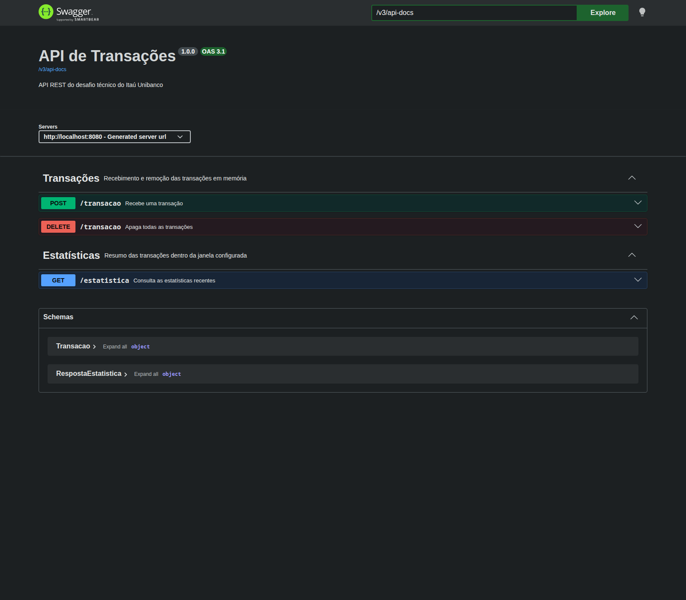

# Desafio Itaú Transações

API REST desenvolvida para o desafio técnico de backend do Itaú Unibanco. A aplicação recebe e
remove transações em memória e calcula estatísticas das transações ocorridas em uma janela de tempo.

## Tecnologias

- Java 21
- Spring Boot 4.1.0
- Spring Web MVC
- Maven Wrapper
- JUnit Jupiter, Spring Boot Test e MockMvc
- Spring Boot Actuator
- Springdoc OpenAPI e Swagger UI
- Docker

## Requisitos

- JDK 21 para execução local
- Docker, opcionalmente, para execução em contêiner

Não é necessário instalar Maven, pois o projeto inclui o Maven Wrapper.

## Execução Com Maven

```bash
./mvnw spring-boot:run
```

A aplicação inicia em `http://localhost:8080`. A raiz `/` permanece sem endpoint e retorna 404 por
decisão do contrato.

## Testes

```bash
./mvnw test
```

Para compilar, executar os testes e gerar o arquivo JAR:

```bash
./mvnw clean package
```

## Execução Com Docker

```bash
docker build -t desafio-itau-transacoes .
docker run --rm -p 8080:8080 desafio-itau-transacoes
```

O Dockerfile usa duas etapas: a primeira compila com JDK 21 e a segunda executa somente com o JRE 21
e um usuário sem privilégios administrativos.

## Endpoints

| Método | Endpoint | Descrição | Respostas |
|---|---|---|---|
| `POST` | `/transacao` | Valida e armazena uma transação | 201, 400 ou 422 |
| `DELETE` | `/transacao` | Remove todas as transações | 200 |
| `GET` | `/estatistica` | Resume as transações da janela atual | 200 |
| `GET` | `/actuator/health` | Informa a saúde da aplicação | 200 |
| `GET` | `/v3/api-docs` | Fornece a especificação OpenAPI em JSON | 200 |
| `GET` | `/swagger-ui/index.html` | Abre a documentação interativa | 200 |

### Receber Transação

```bash
DATA_ATUAL=$(date -Iseconds)
curl -i -X POST http://localhost:8080/transacao \
  -H "Content-Type: application/json" \
  -d "{\"valor\":123.45,\"dataHora\":\"$DATA_ATUAL\"}"
```

Corpo esperado:

```json
{
  "valor": 123.45,
  "dataHora": "2026-07-22T12:34:56.789-03:00"
}
```

- `201 Created`: transação válida, sem corpo de resposta.
- `400 Bad Request`: JSON malformado ou campo em formato incompatível, sem corpo de resposta.
- `422 Unprocessable Content`: campo obrigatório ausente, valor negativo ou data futura, sem corpo.
- Valor zero, datas passadas e o instante atual são aceitos.

### Apagar Transações

```bash
curl -i -X DELETE http://localhost:8080/transacao
```

Retorna `200 OK` sem corpo, mesmo se não houver dados armazenados.

### Consultar Estatísticas

```bash
curl -i http://localhost:8080/estatistica
```

Resposta de exemplo:

```json
{
  "count": 10,
  "sum": 1234.56,
  "avg": 123.456,
  "min": 12.34,
  "max": 123.56
}
```

Quando não há transações na janela, todos os campos retornam zero. Uma transação exatamente no
limite inferior da janela é incluída de forma consistente.

## Demonstração Da API

A documentação interativa pode ser acessada em:

http://localhost:8080/swagger-ui/index.html



## Configuração Da Janela

O valor padrão está em `src/main/resources/application.properties`:

```properties
estatistica.janela-segundos=60
```

É possível substituir a configuração sem alterar o código:

```bash
ESTATISTICA_JANELA_SEGUNDOS=120 ./mvnw spring-boot:run
```

No Docker:

```bash
docker run --rm -p 8080:8080 \
  -e ESTATISTICA_JANELA_SEGUNDOS=120 \
  desafio-itau-transacoes
```

## Decisões Técnicas

### Armazenamento Em Memória

As transações ficam em um `ConcurrentLinkedQueue`. Nenhum banco de dados, cache ou arquivo é usado.
Os dados são perdidos quando o processo termina ou reinicia, conforme exigido pelo desafio. O
repositório devolve uma cópia imutável, evitando que outras camadas modifiquem sua coleção interna.

### Segurança De Concorrência

O Spring pode atender várias requisições simultaneamente. A coleção concorrente permite salvar,
listar e apagar sem uma sincronização manual que bloquearia todas as requisições. A cópia lida pelo
cálculo é uma fotografia fracamente consistente, apropriada para estatísticas em tempo real: uma
transação concorrente pode aparecer no cálculo atual ou no próximo, sem corromper a coleção.

### Datas Com OffsetDateTime

`OffsetDateTime` preserva o deslocamento enviado pelo cliente, como `-03:00`. Para comparar datas de
fusos diferentes, o serviço converte os valores para `Instant`. Um `Clock` injetável usa o relógio real
em produção e `Clock.fixed` nos testes, eliminando esperas e instabilidade temporal.

### Cálculos Com Double

`Double` foi utilizado por alinhamento com o contrato do desafio e com `DoubleSummaryStatistics`.
Aplicações financeiras reais normalmente exigem uma análise cuidadosa sobre precisão decimal e, em
muitos casos, usam `BigDecimal` com escala e arredondamento explicitamente definidos.

### Organização

O controlador cuida do protocolo HTTP, o serviço concentra as regras de negócio e o repositório
isola o armazenamento. A injeção é feita por construtor, sem `@Autowired` em atributos de produção.

```text
src/main/java/com/brielmarca/desafio
├── DesafioItauTransacoesApplication.java
├── configuracao
│   └── ConfiguracaoOpenApi.java
└── transacao
    ├── controlador
    ├── dominio
    ├── excecao
    ├── repositorio
    └── servico
```

## Extras Implementados

- Dockerfile multi-stage e `.dockerignore`
- Healthcheck com Spring Boot Actuator
- Documentação OpenAPI em `/v3/api-docs`
- Swagger UI em `/swagger-ui/index.html`
- Logs de eventos sem registrar o corpo das requisições
- Janela de estatísticas configurável
- Medição em microssegundos do tempo gasto no cálculo
- Testes unitários e de integração determinísticos

## Limitações Conhecidas

- Os dados não sobrevivem a reinícios e não são compartilhados entre múltiplas instâncias.
- Transações antigas permanecem na memória até um `DELETE`, embora sejam ignoradas nas estatísticas.
- O uso de `Double` pode produzir pequenas diferenças binárias em operações decimais.
- Não há autenticação, persistência ou paginação porque essas funcionalidades não fazem parte do
  contrato solicitado.
- Em uma atualização concorrente, a estatística representa os elementos observados durante aquela
  iteração, e não uma transação atômica global.
